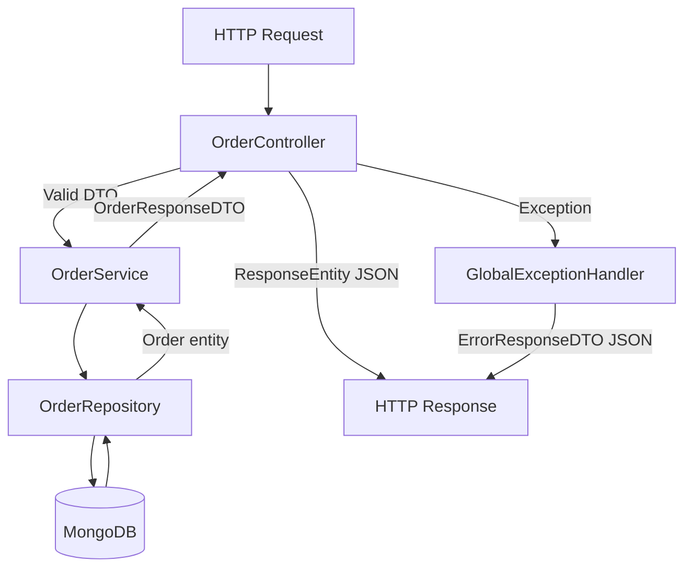
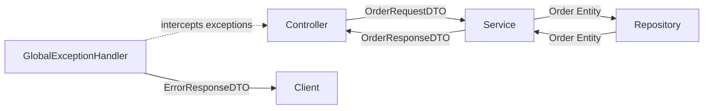

<div align="center">

# 🍓 Fruit Order API - MongoDB

**Developed by:**
[Federico Cantore](https://github.com/FedEx8525)

*(IT Academy Java Bootcamp - Sprint 4 · Task 2 · Level 3)*

---


</div>

---

## 📖 Description

**Fruit Order API** is a RESTful backend application built with **Spring Boot** for managing fruit orders. It allows creating, reading, updating and deleting orders, each containing a client name, a delivery date and a list of fruit items with quantities.

The project follows **MVC architecture**, applies the **DTO pattern** to protect internal entities, uses **MongoDB** as a NoSQL document database, handles exceptions globally via a `GlobalExceptionHandler`, and is fully tested using **TDD** (Test-Driven Development).

---

## 🏗️ Project Architecture

The application is structured following a strict separation of concerns across layers:

```
fruit-order-api
├── src
│   ├── main
│   │   ├── java
│   │   │   └── cat.itacademy.s04.t02.n03.fruit_order_api
│   │   │       ├── controllers        ← HTTP layer (OrderController)
│   │   │       ├── services           ← Business logic (OrderService, OrderServiceImpl)
│   │   │       ├── repository         ← Data access (OrderRepository)
│   │   │       ├── model
│   │   │       │   ├── Order.java     ← MongoDB Document
│   │   │       │   └── OrderItem.java ← Embedded subdocument
│   │   │       ├── dto                ← OrderRequestDTO, OrderResponseDTO, OrderUpdateDTO, OrderItemDTO
│   │   │       ├── mapper             ← OrderMapper (Entity ↔ DTO)
│   │   │       └── exception          ← OrderNotFoundException, GlobalExceptionHandler, ErrorResponseDTO
│   │   └── resources
│   │       └── application.properties
│   └── test
│       └── cat.itacademy.s04.t02.n03.fruit_order_api
│           ├── controllers            ← OrderControllerTest (MockMvc)
│           ├── services               ← OrderServiceImplTest (Mockito)
│           └── OrderIntegrationTest   ← Full flow tests (SpringBootTest)
├── postman
│   └── FruitOrderAPI-N03.postman_collection.json
├── Dockerfile
├── pom.xml
└── README.md
```

---

## 🔄 Request Flow Diagram



---

## 🔄 Layer Responsibilities



---

## 🛠️ Technologies

| Technology | Version | Purpose |
|:-----------|:--------|:--------|
| **Java** | 21 LTS | Main language |
| **Spring Boot** | 3.x | Application framework |
| **Spring Data MongoDB** | - | MongoDB persistence layer |
| **MongoDB** | 8.x | NoSQL document database |
| **Spring Validation** | - | Bean Validation (@Valid) |
| **JUnit 5** | - | Test framework |
| **Mockito** | - | Mocking for unit tests |
| **Maven** | - | Build & dependency management |
| **Docker** | - | Containerization |
| **IntelliJ IDEA** | - | IDE |

---

## 📋 Endpoints

Base URL: `http://localhost:8080`

| Method | Endpoint | Description | Request Body | Response |
|:-------|:---------|:------------|:-------------|:---------|
| `POST` | `/orders` | Create a new order | `OrderRequestDTO` | `201 Created` / `400 Bad Request` |
| `GET` | `/orders` | Get all orders | - | `200 OK` |
| `GET` | `/orders/{id}` | Get order by ID | - | `200 OK` / `404 Not Found` |
| `PUT` | `/orders/{id}` | Update order by ID | `OrderUpdateDTO` | `200 OK` / `404 Not Found` |
| `DELETE` | `/orders/{id}` | Delete order by ID | - | `204 No Content` / `404 Not Found` |

### Request & Response Examples

**POST /orders**
```json
// Request body
{
  "clientName": "Alice",
  "deliveryDate": "2026-04-01",
  "items": [
    { "fruitName": "Apple", "quantityInKilos": 5 },
    { "fruitName": "Banana", "quantityInKilos": 3 }
  ]
}

// Response 201
{
  "id": "6615a2f3e4b0c9a1d2e3f456",
  "clientName": "Alice",
  "deliveryDate": "2026-04-01",
  "items": [
    { "fruitName": "Apple", "quantityInKilos": 5 },
    { "fruitName": "Banana", "quantityInKilos": 3 }
  ]
}
```

**PUT /orders/{id}**
```json
// Request body (all fields optional)
{
  "clientName": "Bob",
  "deliveryDate": "2026-04-10",
  "items": [
    { "fruitName": "Mango", "quantityInKilos": 2 }
  ]
}

// Response 200
{
  "id": "6615a2f3e4b0c9a1d2e3f456",
  "clientName": "Bob",
  "deliveryDate": "2026-04-10",
  "items": [
    { "fruitName": "Mango", "quantityInKilos": 2 }
  ]
}
```

**Error Response (404 / 400 / 500)**
```json
{
  "timestamp": "2026-03-15T10:30:00",
  "status": 404,
  "error": "Not Found",
  "message": "Order not found with id: 6615a2f3e4b0c9a1d2e3f456"
}
```

---

## ⚙️ Configuration

The application uses **environment variables** with default fallback values for local development:

| Variable | Default Value | Description |
|:---------|:-------------|:------------|
| `MONGODB_URI` | `mongodb://localhost:27017/fruit-order-db` | MongoDB connection URI |

In production, set this variable in your environment or Docker run command.

---

## 🚦 Getting Started

### Prerequisites
- Java 21
- Maven 3.x
- MongoDB 8.x running on `localhost:27017`
- Docker (optional)

### Run locally

**1. Clone the repository:**
```bash
git clone https://github.com/FedEx8525/4.2-API-REST-With-MongoDB.git
cd fruit-order-api
```

**2. Start MongoDB:**
```bash
# Windows (as Administrator)
net start MongoDB
```

**3. Build and run:**
```bash
./mvnw spring-boot:run
```

---

### Run with Docker

**1. Build the Docker image:**
```bash
docker build -t fruit-order-api .
```

**2. Run the container:**
```bash
docker run -p 8080:8080 \
  -e MONGODB_URI=mongodb://host.docker.internal:27017/fruit-order-db \
  fruit-order-api
```

---

## 🧪 Testing Strategy

The project follows **TDD (Test-Driven Development)** with three levels of testing:

| Test Class | Type | Tool | What it tests |
|:-----------|:-----|:-----|:--------------|
| `OrderServiceImplTest` | Unit | Mockito | Service logic in isolation |
| `OrderControllerTest` | Unit | MockMvc + Mockito | HTTP layer in isolation |
| `OrderIntegrationTest` | Integration | SpringBootTest | Full request flow with real MongoDB |

**Run all tests:**
```bash
./mvnw test
```

> ⚠️ Integration tests require MongoDB running on `localhost:27017`.

**Test coverage includes:**
- Happy path for all CRUD operations
- 404 Not Found when ID does not exist
- 400 Bad Request when input data is invalid
- Full create → read → update → delete flow (integration)

---

## 🔧 Manual Testing with Postman

## 🔧 Manual Testing with Postman

A Postman collection is available in the `/postman` folder.

**Import the collection:**
1. Open Postman → **Import** → select `Fruit API MongoDB.postman_collection.json`
2. Set the `baseUrl` collection variable to `http://localhost:8080`
3. Start the application locally
4. Run the requests

**Collection structure:**

| Folder | Requests |
|:-------|:---------|
| ✅ Happy Path | CreateOrder, GetAllOrders, GetOrderById, UpdateOrder, DeleteOrder |
| ❌ Error Cases | 404 Not Found (×3), 400 Bad Request (×3) |

**Recommended test flow:**
```bash
POST  /orders        → create an order, {{orderId}} is set automatically
GET   /orders        → verify it appears in the list
GET   /orders/{{orderId}}  → verify by id
PUT   /orders/{{orderId}}  → update and verify the change
DELETE /orders/{{orderId}} → delete
GET   /orders/{{orderId}}  → should return 404 ✅
```

> ⚠️ The `{{orderId}}` variable is set automatically after each POST request via a Post-response script.